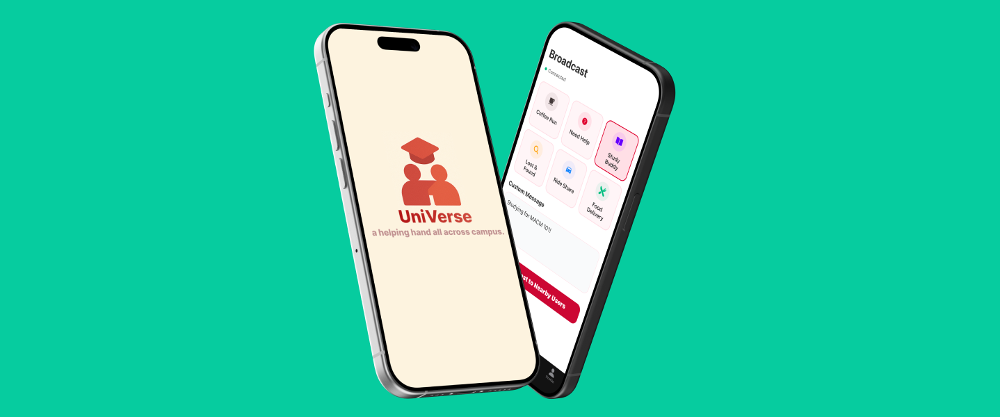
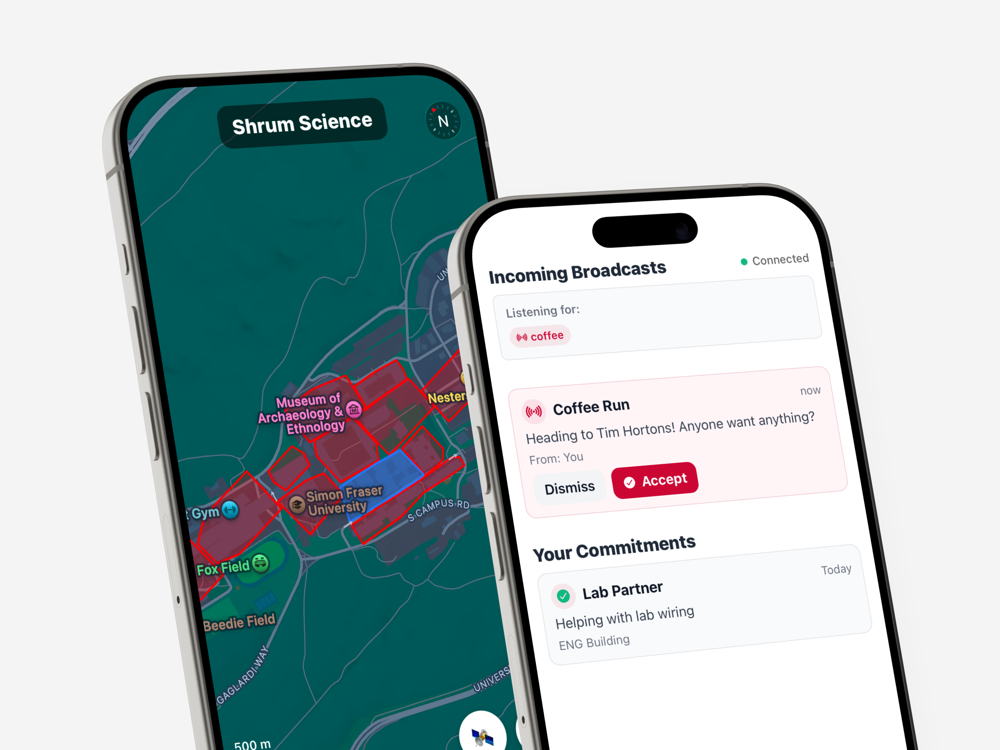
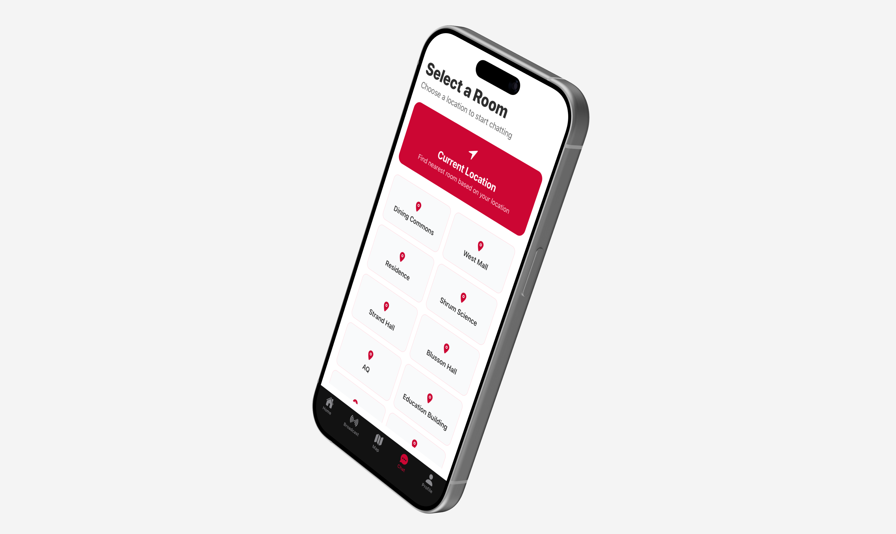
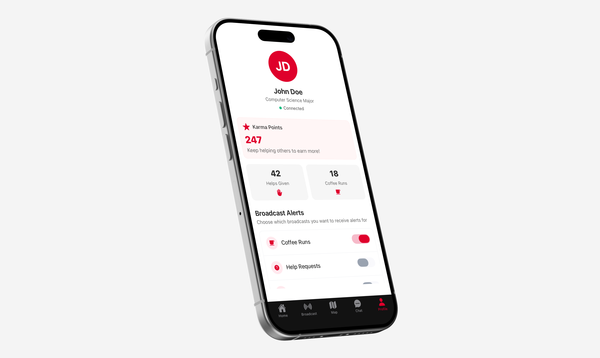

# uniVerse

In Vancouver, students often describe campus life as disconnected, so we designed UniVerse to make it easier and more natural to meet, help, and share resources with each other across campus. 

UniVerse is a proximity-based app for university students to request or offer help instantly, from grabbing coffee or finding study buddies to small on-campus favors. It lets users broadcast short, location-aware posts (like “Need a ride to class” or “Anyone studying in AQ?”), similar in spirit to an Amber Alert for everyday help. 

# Tech Stack

React Native was used for our mobile frontend. Node.js + Websockets were used for real-time communication and support for chat room grouping in our broadcasts. Firebase was used for authentication and user profiles.

# UI Screenshots





# Usage

```git clone``` the repo. Run ```npm i``` in both the ```frontend/``` and ```backend/``` folders to install the dependencies.
- You will need expo for the React Native frontend to work. ```expo start``` will start the client.
- ```npm run dev``` will setup the backend.
